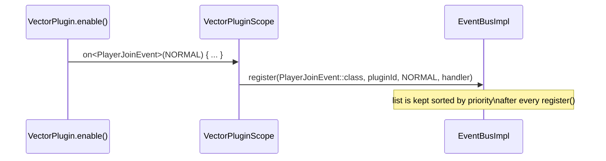
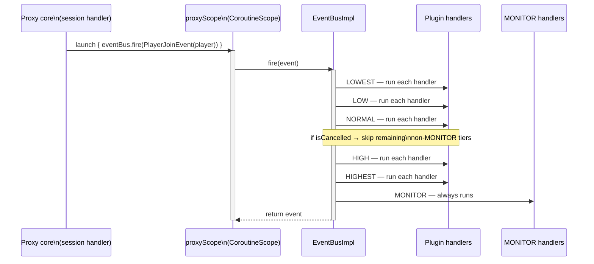
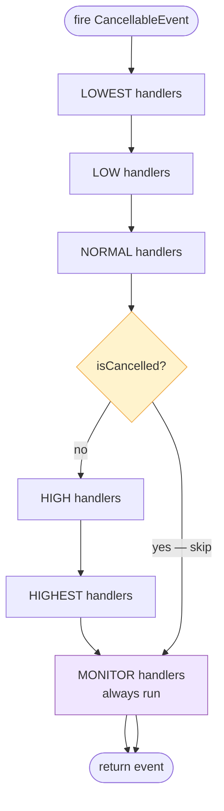

# Event System

Vector's event bus connects the proxy core to plugins without either side
knowing about the other. The core fires events; plugins register handlers.

---

## Architecture

```mermaid
classDiagram
    class VectorEvent
    class CancellableEvent {
        +isCancelled: Boolean
    }
    class EventBus {
        <<interface>>
        +register(KClass~T~, pluginId, priority, handler)
        +unregisterAll(pluginId)
        +fire(event) T
    }
    class EventBusImpl {
        -handlers: ConcurrentHashMap
        +register(...)
        +unregisterAll(...)
        +fire(event) T
    }
    class ProxyServer {
        <<interface>>
        +eventBus: EventBus
    }

    VectorEvent <|-- CancellableEvent
    VectorEvent <|-- ProxyInitializeEvent
    VectorEvent <|-- PlayerJoinEvent
    VectorEvent <|-- PlayerLeaveEvent
    CancellableEvent <|-- "future cancellable events"

    EventBus <|.. EventBusImpl
    ProxyServer --> EventBus
```

`EventBus` is part of `vector-api` (the public plugin surface). Plugins call
`server.eventBus.register(...)` through the `ProxyServer` interface; they never
see `EventBusImpl`.

---

## Handler registration



`on<T>` in the DSL is an `inline reified` function. At the call site Kotlin
resolves `T::class` to `PlayerJoinEvent::class.java` and passes the concrete
`KClass` to `EventBusImpl.register`. No reflection overhead at fire time.

---

## Event firing



The core always fires via `proxyScope.launch { }` so it never blocks the Netty
event loop. Handlers are invoked sequentially within a tier; tiers are run in
priority order.

---

## Cancellable events



Setting `event.isCancelled = true` inside any handler causes all handlers in
**lower** priority tiers to be skipped. `MONITOR` is exempt — it runs
unconditionally, making it the right place for audit logging.

---

## Built-in events

| Event | Cancellable | Fired from | Payload |
|---|---|---|---|
| `ProxyInitializeEvent` | No | `VectorServer.start()` after bind + plugin load | — |
| `PlayerJoinEvent` | No | `BackendLoginSessionHandler.swapToForwarding()` | `player: VectorPlayer` |
| `PlayerLeaveEvent` | No | `ClientPlaySessionHandler.disconnected()` | `player: VectorPlayer` |

---

## Thread / coroutine safety

All `fire` calls from the proxy core are dispatched through `proxyScope.launch`
on `Dispatchers.Default`. Handler lambdas should:

- **Not** block a thread (`Thread.sleep`, synchronous I/O) — use `delay` or
  `withContext(Dispatchers.IO)` instead.
- **Not** call `channel.writeAndFlush` directly — post back to the event loop
  via `channel.eventLoop().execute { }`.
- **Do** use `ConcurrentHashMap` / `AtomicLong` for state shared between
  handlers (different players join on different Netty threads and both fire
  `PlayerJoinEvent`).

---

## Adding a new core event

1. Create `MyEvent.kt` in `vector-api/src/main/kotlin/dev/vector/api/event/`.
2. Extend `VectorEvent` (or `CancellableEvent` if plugins should be able to
   block the action).
3. In the proxy, fire it: `proxyScope.launch { eventBus.fire(MyEvent(...)) }`.
4. Document it in the table above.

That's it — plugins automatically pick it up via `on<MyEvent> { }`.
