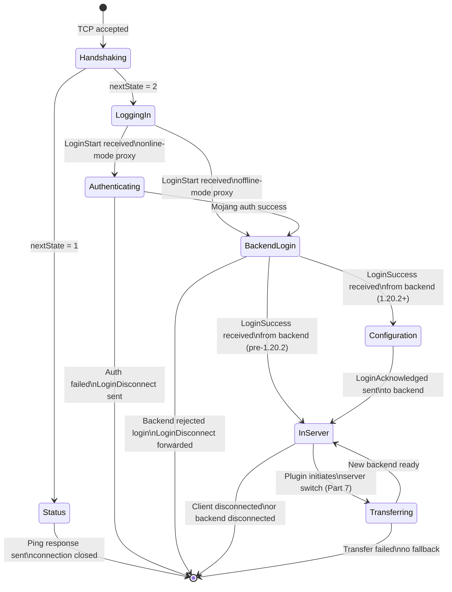
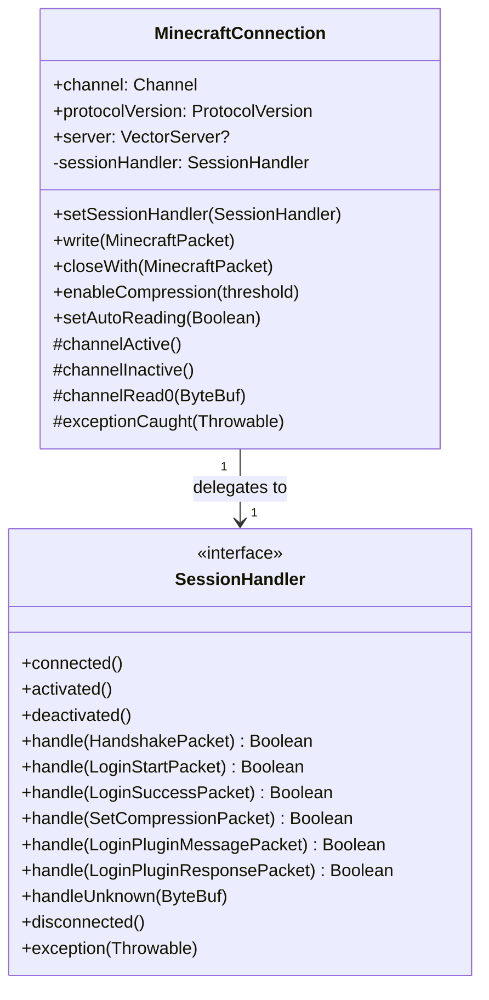
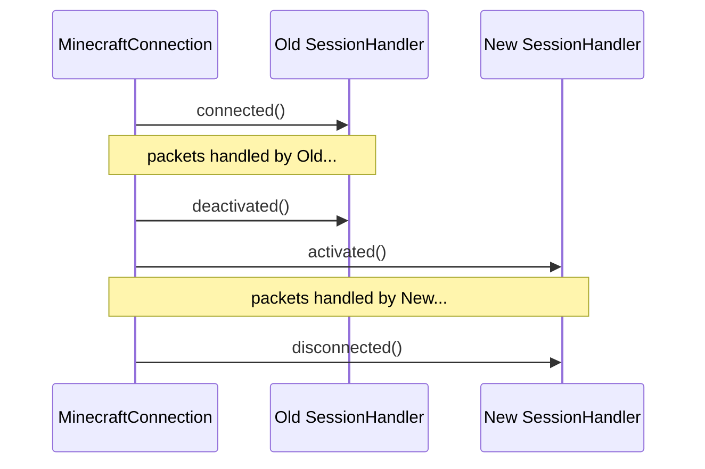

# Player State Machine

Every client connection is modelled as a state machine. A connection always has
exactly one current state, and only valid transitions are permitted. The state
is represented by the active `SessionHandler` on the `MinecraftConnection`.

---

## State diagram



---

## States

| State | Handler class | Description |
|---|---|---|
| **Handshaking** | `HandshakeSessionHandler` | TCP established. Waiting for `HandshakePacket` to learn whether this is a status ping or login. |
| **Status** | `StatusSessionHandler` | Client wants the server list entry. Sends `StatusResponsePacket`, echoes the ping, closes. |
| **LoggingIn** | `LoginSessionHandler` | Login flow started. Sends `EncryptionRequestPacket` to begin auth. |
| **Authenticating** | `AuthSessionHandler` | Waiting on Mojang `hasJoined` HTTP response. Channel auto-reading is paused. |
| **BackendLogin** (client side) | `ClientLoginSuccessSessionHandler` | Client login acknowledged. Backend connection is being established. |
| **BackendLogin** (backend side) | `BackendLoginSessionHandler` | Backend login handshake in progress. Handles compression, modern forwarding, and `LoginSuccess`. |
| **InServer** (client side) | `ClientPlaySessionHandler` | Play phase. Raw packet forwarding — no decode. |
| **InServer** (backend side) | `BackendPlaySessionHandler` | Play phase. Raw packet forwarding — no decode. |

---

## `MinecraftConnection` and `SessionHandler`

The `MinecraftConnection` is a Netty `SimpleChannelInboundHandler` that owns
the channel's lifecycle. It holds a reference to the current `SessionHandler`
and delegates every packet event to it.



### Lifecycle callbacks

When `setSessionHandler(next)` is called, the old handler receives `deactivated()`
and the new one receives `activated()`. When the channel first becomes active,
`connected()` fires on the initial handler.



---

## Login flow detail

The most complex state sequence is the full online-mode login. This covers the
proxy's two simultaneous sessions: one with the client, one with the backend.

```mermaid
sequenceDiagram
    participant C as Client
    participant CP as Proxy (client side)
    participant BP as Proxy (backend side)
    participant B as Backend Server
    participant Moj as Mojang Auth

    C->>CP: Handshake (nextState=2)
    C->>CP: LoginStart (username, uuid)
    CP->>C: EncryptionRequest (serverId, pubkey, verify)
    C->>C: Generate shared secret
    C->>Moj: POST /session/minecraft/join
    C->>CP: EncryptionResponse (encrypted secret + verify)
    CP->>CP: Decrypt shared secret
    CP->>Moj: GET /hasJoined?username=…&serverId=…
    Moj-->>CP: GameProfile (uuid, name, properties)

    Note over CP: Auth OK — enable AES cipher,\ncreate VectorPlayer,\nsend SetCompression to client

    CP->>C: SetCompression (threshold=256)
    CP->>CP: enableCompression(client channel)
    CP->>BP: Bootstrap backend TCP connection
    BP->>B: Handshake (+ forwarding data if legacy/bungeeguard)
    BP->>B: LoginStart (player username + uuid)
    B->>BP: SetCompression (optional)
    BP->>BP: enableCompression(backend channel)
    B->>BP: LoginSuccess (or LoginPluginMessage if modern forwarding)
    BP->>CP: (internal signal)
    CP->>C: LoginSuccess

    alt 1.20.2+ (protocol ≥ 764)
        C->>CP: LoginAcknowledged
        CP->>B: LoginAcknowledged
    end

    Note over CP,BP: swapToForwarding():\nremove packet-decoder + encoder from both pipelines\nfire PlayerJoinEvent

    C<-->>CP: Raw ByteBuf forwarding
    CP<-->>BP: (pass-through)
    BP<-->>B: Raw ByteBuf forwarding
```

---

## Play-phase forwarding

Once `swapToForwarding()` runs, `ClientPlaySessionHandler` and
`BackendPlaySessionHandler` do exactly one thing each: copy a `ByteBuf` to the
peer's channel.

```kotlin
// ClientPlaySessionHandler — client → backend
override fun handleUnknown(buf: ByteBuf) {
    val backend = player.currentBackendConn ?: return
    if (backend.channel.isActive) {
        buf.retain()                         // bump refcount: 1 → 2
        backend.channel.writeAndFlush(buf)   // Netty will release after write: 2 → 1 → 0
    }
}

// BackendPlaySessionHandler — backend → client
override fun handleUnknown(buf: ByteBuf) {
    if (player.connection.channel.isActive) {
        buf.retain()
        player.connection.channel.writeAndFlush(buf)
    }
}
```

The `buf` arriving at `handleUnknown` is a decompressed `[packetId | data]`
slice. The receiving channel's `compress-encoder` + `frame-encoder` re-wraps
it with the appropriate framing before sending to the wire.

---

## Auto-reading and backpressure

`setAutoReading(false)` pauses inbound TCP reads on a channel. The proxy uses
this in two places:

1. **During auth** (`AuthSessionHandler`): pauses the client channel while the
   Mojang HTTP call is in flight. Prevents receiving play packets before auth
   completes.
2. **During backend connect** (`AuthSessionHandler` → `BackendConnection`):
   pauses the client channel while the TCP connection to the backend is being
   established. Prevents sending packets to a backend that isn't ready yet.

`setAutoReading(true)` is called in `swapToForwarding()` just before the play
handlers are installed, which is the signal that both pipelines are ready.
