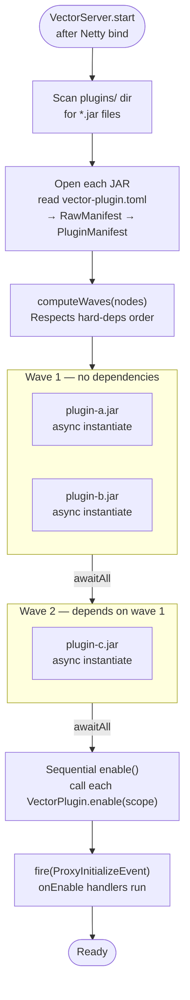
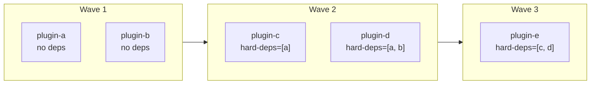
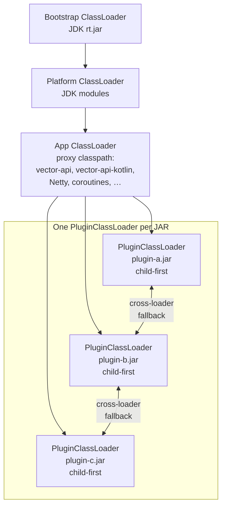

# Plugin Loader

The plugin loader lives in `dev.vector.proxy.plugin` and runs at proxy startup
after the Netty server socket is bound.

---

## Loading pipeline



Instantiation within a wave is parallel (`async(Dispatchers.Default)`).
Waves are sequential — a plugin in wave N is guaranteed that every plugin it
declared in `hard-deps` has been instantiated and enabled.

---

## Dependency wave algorithm



`computeWaves()` is a greedy BFS: each iteration collects all nodes whose
hard-deps are satisfied, emits them as a wave, marks them loaded, repeats.
A non-empty remaining set with no satisfiable nodes means a cycle — startup
aborts with a clear error.

`soft-deps` are not enforced by the wave algorithm. They are reserved for
future use (e.g. ordering within a wave, optional service lookup).

---

## Class loader hierarchy



**Lookup order for any class name:**

1. Is it `dev.vector.api.*`, `kotlin.*`, `kotlinx.*`, `java.*`, `org.slf4j.*`?
   → delegate straight to parent (guarantees shared type identity).
2. Is it already loaded by *this* loader? → return cached.
3. Does *this* JAR contain it? → define and return.
4. Does any *other* `PluginClassLoader` contain it? → borrow and return.
5. Delegate to parent (proxy classpath).

Step 4 is the cross-plugin class sharing mechanism. Plugin A can depend on
classes shipped by Plugin B without bundling them — the same `Class<?>` object
is returned from both loaders so `instanceof` and casts work correctly.

---

## Plugin manifest reference

```toml
# Required
id          = "my-plugin"          # unique across all loaded plugins
version     = "1.0.0"
entrypoint  = "com.example.MyPlugin"   # fully-qualified class name

# Optional with defaults
name        = "My Plugin"          # display name, falls back to id
api-version = "1.0"
language    = "KOTLIN"             # KOTLIN | JAVA

# Dependency declarations
hard-deps   = ["database-plugin"]  # must be present and loaded first
soft-deps   = ["stats-plugin"]     # load before this plugin if present
```

The manifest is read from `vector-plugin.toml` at the root of the JAR
(i.e. `src/main/resources/vector-plugin.toml` in a standard Gradle layout).

---

## PluginContainer

After a plugin is instantiated and enabled, `PluginManager` holds a
`PluginContainer` for it:

```kotlin
data class PluginContainer(
    val manifest: PluginManifest,
    val instance: Any,           // the VectorPlugin subclass instance
    val scope: CoroutineScope,   // SupervisorJob + Dispatchers.Default
)
```

The `scope` is the same one passed to `VectorPluginScope`. If the proxy ever
needs to unload a plugin, cancelling this scope cancels every coroutine the
plugin launched.
