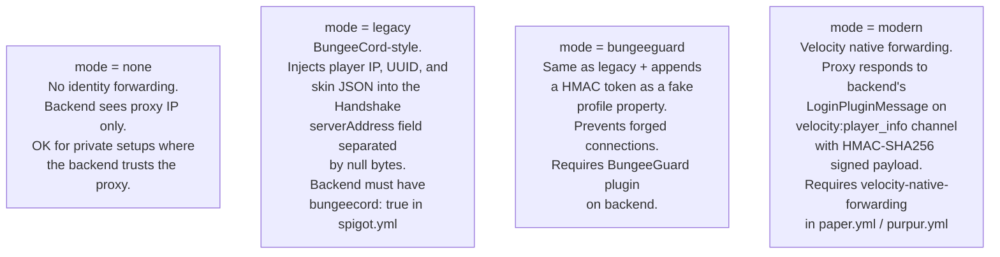
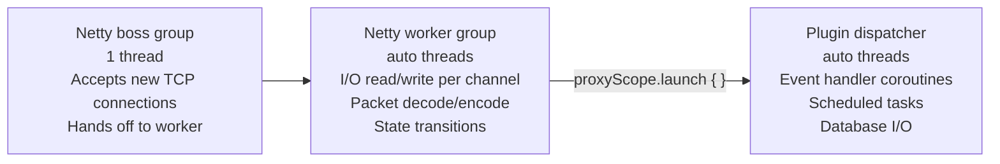
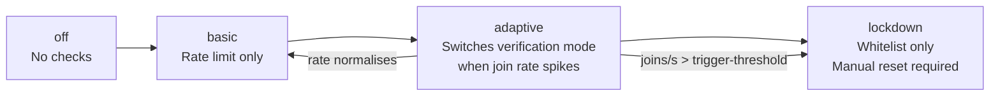
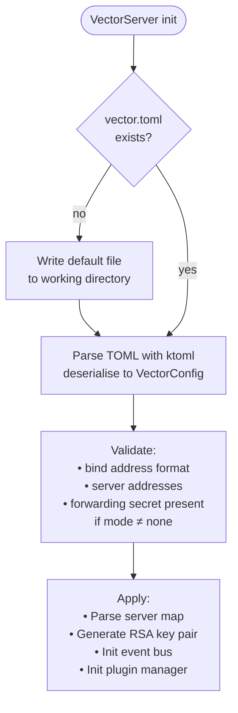

# Configuration Reference

Vector uses TOML for all configuration. On first start the proxy writes a
default `vector.toml` to the working directory if the file does not exist.

---

## Current implemented config (`vector.toml`)

This is the full schema that is **active today** (Parts 1–6):

```toml
# Address the proxy listens on. Format: "host:port"
bind = "0.0.0.0:25565"

# Backend servers: name → "host:port"
[servers]
lobby = "localhost:25577"

# Which server(s) to try when a player first connects.
# Tried in order; first reachable one wins.
[routing]
try = ["lobby"]

# How the proxy passes player identity to backend servers.
[forwarding]
mode   = "none"     # none | legacy | bungeeguard | modern
secret = ""         # HMAC key for modern / token for bungeeguard

# Packet compression between proxy and clients.
[compression]
threshold = 256     # bytes; -1 to disable
```

### Forwarding modes

The proxy sits between the client and backend. Because the backend receives a
connection from the proxy's IP (not the player's), forwarding modes exist to
pass the real player IP, UUID, and skin properties to the backend.



Choose **modern** for Paper-based backends. Use **bungeeguard** for Spigot/Bukkit
backends. Use **none** only if the backend is completely firewalled from the
internet.

---

## Planned config (`vector.toml` — Part 7)

The sections below describe the full config schema that will be implemented in
Part 7. They are documented here so the design is settled before coding begins.

### Threading

```toml
[threading]
plugin-dispatcher-threads = 0   # 0 = auto (availableProcessors × 2)
netty-boss-threads        = 1
netty-worker-threads      = 0   # 0 = auto (availableProcessors × 2)
```

Vector uses three distinct thread pools:



The Netty worker group never suspends or blocks. All plugin work — including
event handlers — crosses into `Dispatchers.Default` via `proxyScope.launch`.

### Player experience

```toml
[player-experience]
player-count-modifier        = 1.0
player-count-minimum         = 0
player-count-maximum-padding = 20
hide-player-count            = false

[player-experience.backend-disconnect]
action           = "send-to-fallback"   # send-to-fallback | kick | limbo
fallback-message = "<red>Lost connection to server..."
limbo-timeout    = 120                  # seconds before kicking from limbo
limbo-countdown  = true
```

`player-count-modifier` scales the online count shown in the server list
(useful for showing a larger number than the real count). The actual cap is
`max(player-count-minimum, real_count) + player-count-maximum-padding`.

### Protection

```toml
[protection.rate-limiting]
connections-per-second   = 10
connections-burst        = 20
login-attempts-per-minute = 5

[protection.anti-bot]
enabled = true
mode    = "adaptive"   # off | basic | adaptive | lockdown

[protection.anti-bot.adaptive]
trigger-threshold       = 20     # joins/s before switching to verification
verification-mode       = "kick-rejoin"
whitelist-known-players = true

[protection.geoip]
enabled           = false
database          = "./geoip/GeoLite2-Country.mmdb"
blocked-countries = []
```

Anti-bot mode progression:



### Management

```toml
[management.maintenance]
enabled          = false
message          = "<red>Server is under maintenance."
allow-permission = "vector.maintenance.bypass"

[management.forced-hosts]
"lobby.mynetwork.net" = "lobby"
"*.mynetwork.net"     = "lobby"
```

Forced hosts let players connect via a subdomain and be routed to a specific
server regardless of the `routing.try` list. The proxy reads the `serverAddress`
field from the Handshake packet which contains the hostname the client used.

### Observability

```toml
[observability.metrics]
enabled  = true
provider = "prometheus"
bind     = "0.0.0.0:9090"

[observability.logging]
format             = "pretty"   # pretty | json
include-player-ips = false      # set false for GDPR compliance
log-commands       = false      # true only for auditing (PII risk)
```

### Limbo

```toml
[limbo]
unclaimed-action    = "kick"
unclaimed-message   = "<red>Server unavailable."
max-hold-duration   = 120   # seconds before kicking held players
keep-alive-interval = 15    # seconds between keep-alive packets
keep-alive-timeout  = 30    # seconds without response before declaring dead
```

Limbo holds authenticated players in a minimal fake world when no backend
server is available. The proxy is responsible for keep-alive packets during
this period — the player's client must not time out.

### Per-server overrides

Any top-level config key can be overridden per server using dot-notation:

```toml
[servers.lobby.overrides]
"transfer.cooldown.enabled"          = false
"player-experience.chat.filter-spam" = false
```

---

## Config loading flow


