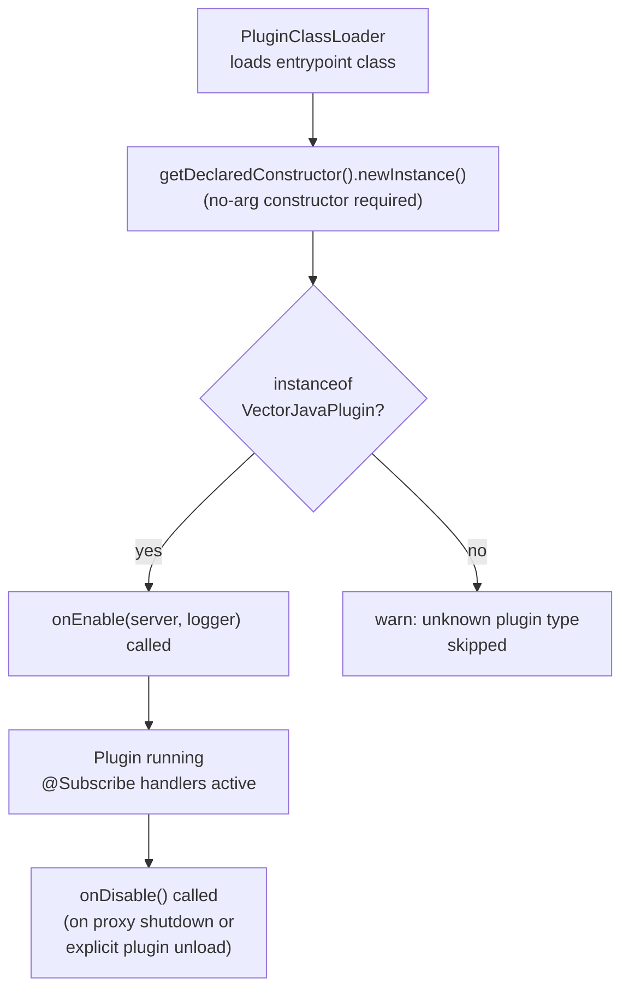

# Java Plugin API

Java plugins compile against `vector-api` only — they do not need the Kotlin
DSL module. The Java API surface consists of plain Java interfaces with no
Kotlin-specific constructs.

> **Status:** The `VectorJavaPlugin` base class and `@Subscribe` annotation
> processor are planned for Part 7. The interfaces and event types in
> `vector-api` are already usable from Java today.

---

## Dependency (Java plugin `build.gradle`)

```groovy
dependencies {
    compileOnly "dev.vector:vector-api:1.0.0-SNAPSHOT"
}
```

Or in Kotlin DSL:

```kotlin
dependencies {
    compileOnly(project(":vector-api"))
}
```

---

## Plugin manifest (`vector-plugin.toml`)

```toml
id         = "my-java-plugin"
name       = "My Java Plugin"
version    = "1.0.0"
api-version = "1.0"
entrypoint = "com.example.MyJavaPlugin"
language   = "JAVA"
```

Setting `language = "JAVA"` tells the plugin loader to instantiate the class
via reflection rather than through the Kotlin `VectorPlugin` DSL path.

---

## Plugin class (planned API)

```java
public class MyJavaPlugin extends VectorJavaPlugin {

    @Override
    public void onEnable(ProxyServer server, Logger logger) {
        logger.info("Java plugin enabled! Proxy v{}", server.getVersion());

        server.getEventBus().register(
            PlayerJoinEvent.class,
            this,
            EventPriority.NORMAL,
            this::onPlayerJoin
        );
    }

    private void onPlayerJoin(PlayerJoinEvent event) {
        getLogger().info("{} joined", event.getPlayer().getUsername());
    }

    @Override
    public void onDisable() {
        getLogger().info("Disabled.");
    }
}
```

### Async event handlers (Java)

Java plugin handlers are invoked as `CompletableFuture`-returning methods.
Vector wraps the future in the plugin's coroutine scope for structured
cancellation:

```java
private CompletableFuture<Void> onPlayerJoin(PlayerJoinEvent event) {
    return CompletableFuture.runAsync(() -> {
        // Blocking work is OK here — it runs on the plugin dispatcher
        String welcome = database.fetchWelcome(event.getPlayer().getUuid());
        getLogger().info("Welcome message for {}: {}", event.getPlayer().getUsername(), welcome);
    }, getPluginExecutor());
}
```

`getPluginExecutor()` returns an `Executor` backed by the plugin's
`CoroutineScope` dispatcher. Using any other executor bypasses structured
concurrency and is not recommended.

---

## Using `ProxyServer` from Java

All `ProxyServer` methods are `@NotNull`-annotated and return Java-compatible
types:

```java
ProxyServer server = getServer();

// Player lookup
Optional<VectorPlayer> player = Optional.ofNullable(server.getPlayer(uuid));

// Online player list
Collection<? extends VectorPlayer> online = server.getPlayers();

// Event bus — direct registration without DSL
server.getEventBus().register(
    PlayerLeaveEvent.class,
    pluginId,
    EventPriority.NORMAL,
    event -> logger.info("{} left", event.getPlayer().getUsername())
);
```

---

## Event registration from Java

The `EventBus` interface is Java-friendly. The `handler` parameter is a
`suspend (T) -> Unit` Kotlin function type, but from Java it is callable as a
`kotlin.jvm.functions.Function1<T, kotlin.coroutines.Continuation<? super Unit>>`.

In practice, use the `@Subscribe` annotation (Part 7) which generates the
correct adapter automatically:

```java
@Subscribe(priority = EventPriority.HIGH)
public void onJoin(PlayerJoinEvent event) {
    // ...
}
```

---

## Java plugin lifecycle



Unlike the Kotlin DSL path, the Java plugin's `onEnable` receives `server` and
`logger` as parameters rather than through a scope receiver. This matches the
Velocity plugin API convention that Java developers are familiar with.
