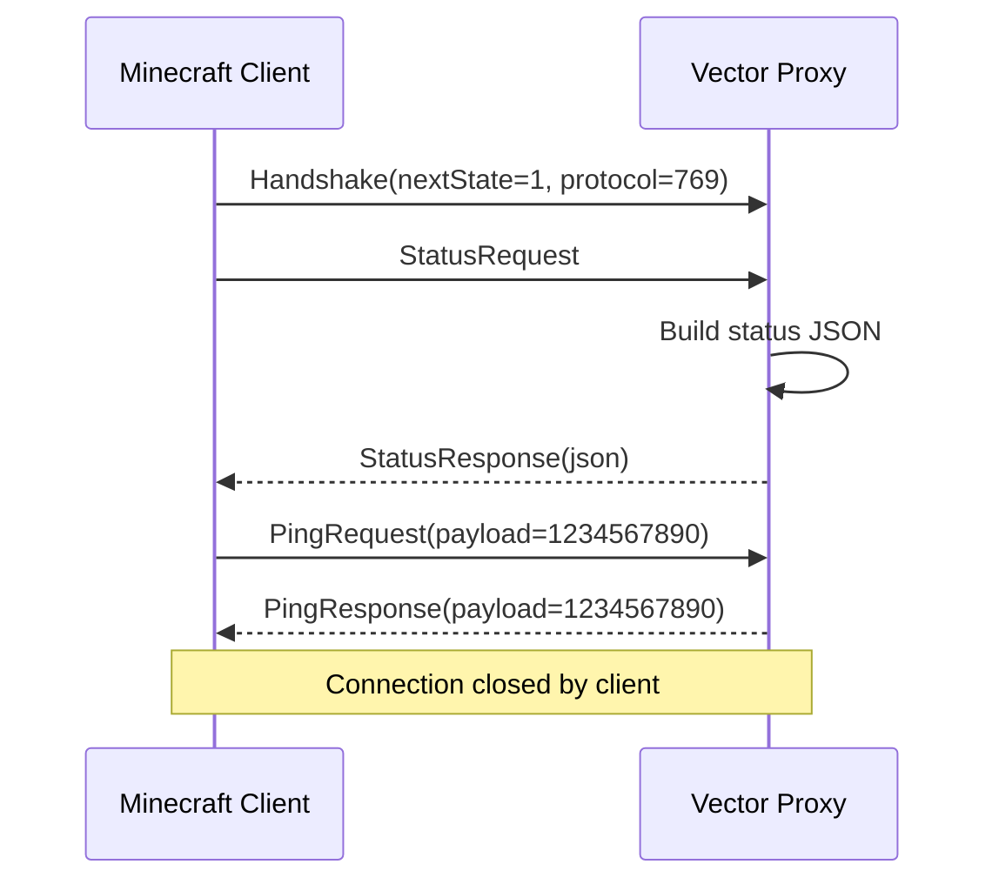

# Packets

Every packet in Vector implements the `MinecraftPacket` interface:

```kotlin
interface MinecraftPacket {
    fun decode(buf: ByteBuf, version: ProtocolVersion)
    fun encode(buf: ByteBuf, version: ProtocolVersion)
    fun handle(handler: SessionHandler): Boolean
}
```

`decode` reads the packet's fields from a `ByteBuf` that contains exactly one
packet's payload — the packet ID has already been stripped by the decoder.
`encode` writes the packet's fields into the provided `ByteBuf` — the ID is
written by `MinecraftPacketEncoder`, not by the packet itself. The `ProtocolVersion`
parameter allows a single class to handle version-conditional fields without
subclassing.

`handle` dispatches to the appropriate method on the active `SessionHandler`.
The default return value is `false` (not handled); returning `true` tells the
decoder the packet was consumed.

---

## Handshake state

| Direction | ID | Class | Fields |
|---|---|---|---|
| Serverbound | `0x00` | `HandshakePacket` | `protocolVersion: Int`, `serverAddress: String`, `serverPort: Int`, `nextState: Int` |

`nextState` determines what protocol phase follows:
- `1` → Status (server list ping)
- `2` → Login

`serverAddress` carries the hostname the client connected to. For legacy
BungeeCord forwarding it is rewritten to inject player IP and UUID. For forced
hosts routing it is read to determine the destination server.

---

## Status state

| Direction | ID | Class | Fields |
|---|---|---|---|
| Serverbound | `0x00` | `StatusRequestPacket` | *(none)* |
| Serverbound | `0x01` | `PingRequestPacket` | `payload: Long` |
| Clientbound | `0x00` | `StatusResponsePacket` | `json: String` |
| Clientbound | `0x01` | `PingResponsePacket` | `payload: Long` (echoed) |

### Status ping sequence



### Status response JSON schema

```json
{
  "version": {
    "name": "1.21.4",
    "protocol": 769
  },
  "players": {
    "max": 100,
    "online": 3,
    "sample": [
      { "name": "Alice", "id": "uuid-string" }
    ]
  },
  "description": { "text": "A Vector Proxy" },
  "favicon": "data:image/png;base64,..."
}
```

The `version.protocol` field is negotiated from the client's `Handshake`
protocol version. The MOTD DSL (Part 7) will replace the static description
with a fully configurable Adventure component.

---

## Login state

### Serverbound

| ID | Class | Fields | Notes |
|---|---|---|---|
| `0x00` | `LoginStartPacket` | `username: String`, `uuid: UUID` | UUID present 1.19.3+ (protocol ≥ 761) |
| `0x01` | `EncryptionResponsePacket` | `sharedSecret: ByteArray`, `verifyToken: ByteArray` | RSA-encrypted with server's public key |
| `0x02` | `LoginPluginResponsePacket` | `messageId: Int`, `success: Boolean`, `data: ByteArray` | Response to server's plugin channel message |
| `0x03` | `LoginAcknowledgedPacket` | *(none)* | 1.20.2+ (protocol ≥ 764) — client acknowledges LoginSuccess |

### Clientbound

| ID | Class | Fields | Notes |
|---|---|---|---|
| `0x00` | `LoginDisconnectPacket` | `reason: String` (JSON text) | Kicks the client during login |
| `0x01` | `EncryptionRequestPacket` | `serverId: String`, `publicKey: ByteArray`, `verifyToken: ByteArray` | Begins online-mode auth |
| `0x02` | `LoginSuccessPacket` | `uuid: UUID`, `username: String`, `properties: List<ProfileProperty>` | Login approved; skin data included |
| `0x03` | `SetCompressionPacket` | `threshold: Int` | Enables packet compression. `-1` disables. |
| `0x04` | `LoginPluginMessagePacket` | `messageId: Int`, `channel: String`, `data: ByteArray` | Used by modern forwarding (`velocity:player_info`) |

---

## Full login flow (online mode, 1.20.2+)

```mermaid
sequenceDiagram
    participant C as Client
    participant P as Proxy
    participant Moj as Mojang Auth
    participant B as Backend (offline mode)

    C->>P: Handshake(nextState=2, protocol=769)
    C->>P: LoginStart(username="Alice", uuid)

    P->>C: EncryptionRequest(serverId, pubKey, verifyToken)
    C->>Moj: POST /session/minecraft/join (with shared secret hash)
    C->>P: EncryptionResponse(encrypted sharedSecret, encrypted verifyToken)
    P->>P: Decrypt, verify token, enable AES cipher
    P->>Moj: GET /hasJoined?username=Alice&serverId=...
    Moj-->>P: 200 GameProfile {uuid, name, properties}

    P->>C: SetCompression(threshold=256)
    P->>P: Enable compression on client channel

    P->>B: Handshake(serverAddress = modified for forwarding mode)
    P->>B: LoginStart(username="Alice", uuid)
    B->>P: SetCompression(threshold)
    P->>P: Enable compression on backend channel
    B->>P: LoginPluginMessage(channel="velocity:player_info") [if modern forwarding]
    P->>B: LoginPluginResponse(signed payload with IP + UUID + properties)
    B->>P: LoginSuccess

    P->>C: LoginSuccess(uuid, username, properties)
    C->>P: LoginAcknowledged
    P->>B: LoginAcknowledged

    Note over P: swapToForwarding()
    Note over P: Remove packet-decoder + packet-encoder from both pipelines
    Note over P: fire PlayerJoinEvent
    C<-->>P<-->>B: Raw ByteBuf forwarding
```

---

## Player info forwarding formats

### Modern (Velocity native)

The backend sends `LoginPluginMessage(channel="velocity:player_info")`. The
proxy responds with a binary payload signed with HMAC-SHA256:

```
┌------------------------------------------------------------┐
│  HMAC-SHA256 signature (32 bytes)                          │
│  Forwarding version (VarInt)                               │
│  Player IP (String)                                        │
│  Player UUID (UUID — 16 bytes)                             │
│  Player username (String)                                  │
│  Profile properties count (VarInt)                         │
│  [For each property: name, value, signed, signature]       │
└------------------------------------------------------------┘
```

The HMAC key is the `forwarding.secret` from `vector.toml`. The backend
verifies the signature before accepting the forwarded identity.

### Legacy (BungeeCord)

The proxy rewrites the `serverAddress` field in the `HandshakePacket` it sends
to the backend:

```
original_host\x00player_ip\x00undashed_uuid\x00json_properties
```

The null byte (`\x00`) is the separator. The backend reads and splits on null
bytes to recover the player identity.

### BungeeGuard

Identical to Legacy, but appends one additional fake profile property:

```json
{ "name": "bungeeguard-token", "value": "<hmac-signed-token>" }
```

The BungeeGuard Bukkit plugin on the backend verifies this token.

---

## Adding a new packet

1. Create `MyPacket.kt` in the appropriate
   `dev.vector.proxy.protocol.packet.<state>/` directory.
2. Implement `MinecraftPacket` with `decode`, `encode`, and `handle`.
3. Add a `handle(MyPacket)` override to `SessionHandler` (defaults to `false`).
4. Register in `StateRegistry`:
   ```kotlin
   register(MyPacket::class, MINECRAFT_1_7_2, 0xNN) { MyPacket() }
   ```
5. Override `handle(MyPacket)` in the relevant `SessionHandler` implementations.
