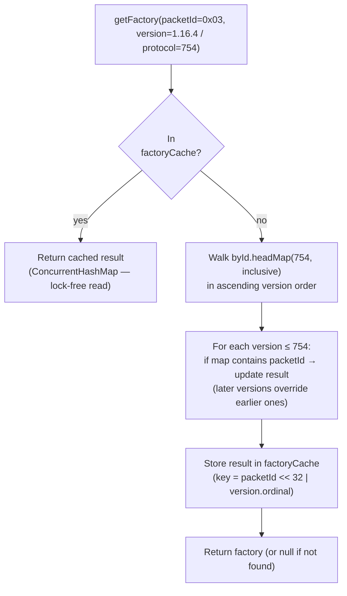
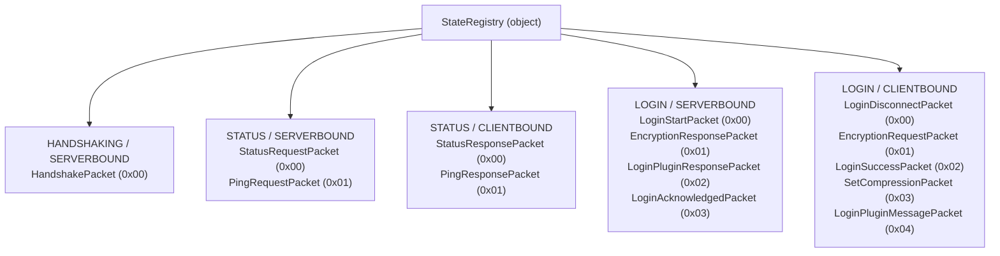
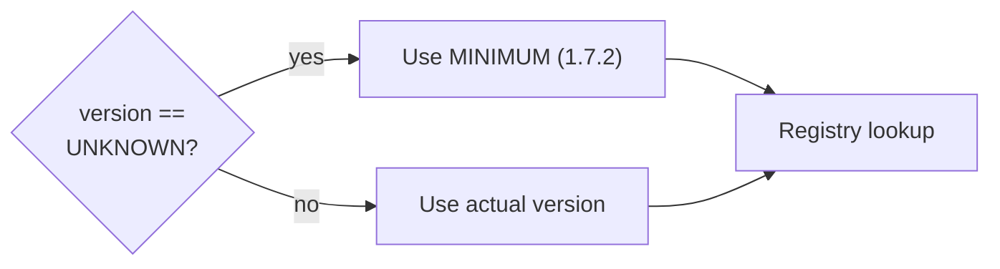

# Packet Registry

The registry maps `(ProtocolState, Direction, ProtocolVersion, PacketID)` to a
packet factory, and maps `(ProtocolState, Direction, ProtocolVersion, PacketClass)`
back to a packet ID. Both directions of this mapping are needed: decoding uses
ID → factory; encoding uses class → ID.

---

## Design goals

| Goal | How it's met |
|---|---|
| Multi-version from day one | Every lookup passes a `ProtocolVersion`; the registry finds the best match |
| Nearest-lower-version fallback | `TreeMap.headMap(version, inclusive)` gives all entries ≤ version |
| One class per packet | Version-conditional fields live inside `decode`/`encode` — no subclassing |
| Fast hot-path lookup | `ConcurrentHashMap` caches resolved lookups after the first call |

---

## Lookup algorithm



The accumulated-walk approach (rather than a simple floor-entry) is required
because a packet might have its ID reassigned in a later version. Without the
walk, registering the same class at multiple versions with different IDs would
return only the highest registered version's ID, losing the lower-version entry
for intermediate versions.

**Example — LoginStart (`0x00` → `0x02` in 1.19.3):**

```kotlin
register(LoginStartPacket::class, MINECRAFT_1_7_2, 0x00) { LoginStartPacket() }
register(LoginStartPacket::class, MINECRAFT_1_19_3, 0x02) { LoginStartPacket() }
```

| Query version | Returns |
|---|---|
| 1.8 (protocol 47) | factory at ID `0x00` |
| 1.19 (protocol 759) | factory at ID `0x00` |
| 1.19.3 (protocol 761) | factory at ID `0x02` |
| 1.21.4 (protocol 769) | factory at ID `0x02` |

---

## `DirectionRegistry`

Holds mappings for a single `(ProtocolState, Direction)` pair. Two `TreeMap`
instances, keyed by protocol version integer, provide the floor-entry walk:

```kotlin
class DirectionRegistry {
    // protocol_int → { packet_id → factory }
    private val byId    = TreeMap<Int, MutableMap<Int, () -> MinecraftPacket>>()
    // protocol_int → { packet_class → packet_id }
    private val byClass = TreeMap<Int, MutableMap<KClass<*>, Int>>()

    // Lookup caches — invalidated on every register() call
    private val factoryCache = ConcurrentHashMap<Long, (() -> MinecraftPacket)?>()
    private val idCache      = ConcurrentHashMap<Pair<KClass<*>, ProtocolVersion>, Int?>()

    fun register(
        clazz: KClass<out MinecraftPacket>,
        sinceVersion: ProtocolVersion,
        id: Int,
        factory: () -> MinecraftPacket,
    ) {
        byId.getOrPut(sinceVersion.protocol) { mutableMapOf() }[id] = factory
        byClass.getOrPut(sinceVersion.protocol) { mutableMapOf() }[clazz] = id
        factoryCache.clear()   // invalidate both caches on schema change
        idCache.clear()
    }

    fun getFactory(packetId: Int, version: ProtocolVersion): (() -> MinecraftPacket)? {
        val cacheKey = (packetId.toLong() shl 32) or version.ordinal.toLong()
        factoryCache[cacheKey]?.let { return it }
        var result: (() -> MinecraftPacket)? = null
        byId.headMap(version.protocol, true).values.forEach { map ->
            map[packetId]?.also { result = it }
        }
        factoryCache[cacheKey] = result
        return result
    }

    fun getPacketId(clazz: KClass<*>, version: ProtocolVersion): Int? {
        val cacheKey = Pair(clazz, version)
        idCache[cacheKey]?.let { return it }
        var result: Int? = null
        byClass.headMap(version.protocol, true).values.forEach { map ->
            map[clazz]?.also { result = it }
        }
        idCache[cacheKey] = result
        return result
    }
}
```

The cache keys are compact: `factoryCache` encodes both `packetId` and
`version.ordinal` into a single `Long` to avoid object allocation on the hot
lookup path.

---

## `StateRegistry`

The singleton that assembles all `DirectionRegistry` instances. Each
`(ProtocolState, Direction)` pair gets its own registry:



New packets are registered inside the appropriate `apply` block:

```kotlin
object StateRegistry {
    val SERVERBOUND = mapOf(
        ProtocolState.LOGIN to DirectionRegistry().apply {
            register(LoginStartPacket::class, MINECRAFT_1_7_2, 0x00) { LoginStartPacket() }
            register(LoginStartPacket::class, MINECRAFT_1_19_3, 0x02) { LoginStartPacket() }
            register(EncryptionResponsePacket::class, MINECRAFT_1_7_2, 0x01) { EncryptionResponsePacket() }
            register(LoginPluginResponsePacket::class, MINECRAFT_1_7_2, 0x02) { LoginPluginResponsePacket() }
            register(LoginAcknowledgedPacket::class, MINECRAFT_1_7_2, 0x03) { LoginAcknowledgedPacket() }
        },
        // ...
    )
}
```

---

## Unknown packets

If `getFactory()` returns `null` for a given `(packetId, version)` pair, the
decoder silently discards the `ByteBuf`. This is intentional: the proxy must
not crash on packets it does not yet handle — they are simply forwarded as raw
bytes during play phase.

During login phase, unknown packets from the client are dropped. Unknown packets
from the backend are also dropped unless the connection is in play-forwarding
mode, in which case raw forwarding bypasses the registry entirely.

---

## `UNKNOWN` version bootstrap

Before the `HandshakePacket` arrives the client's protocol version is
`ProtocolVersion.UNKNOWN` (protocol integer `−1`). A floor-entry lookup with
`−1` would find nothing in the `TreeMap`.

Both `MinecraftPacketDecoder` and `MinecraftPacketEncoder` fall back to
`ProtocolVersion.MINIMUM` (1.7.2, protocol integer `4`) when the version is
`UNKNOWN`. Since Handshake and Status packet IDs have not changed across any
version, this fallback always succeeds.


